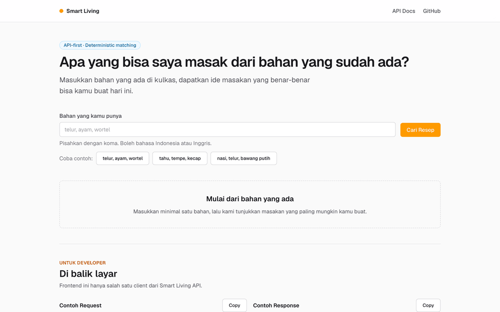
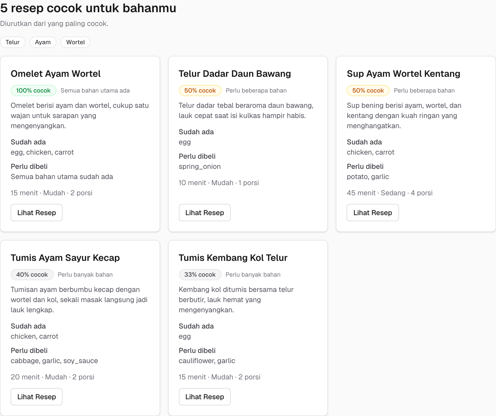
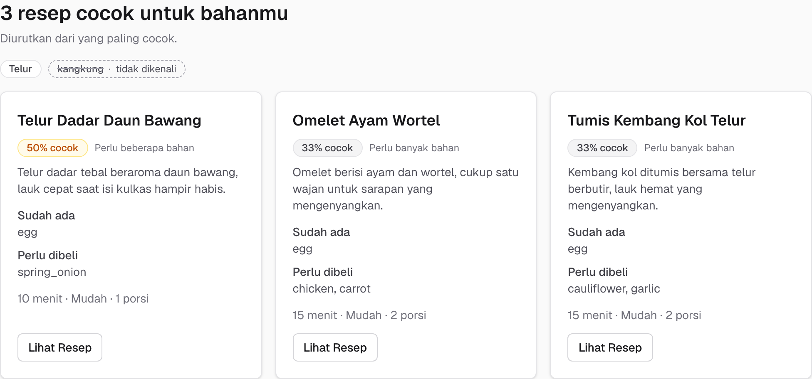
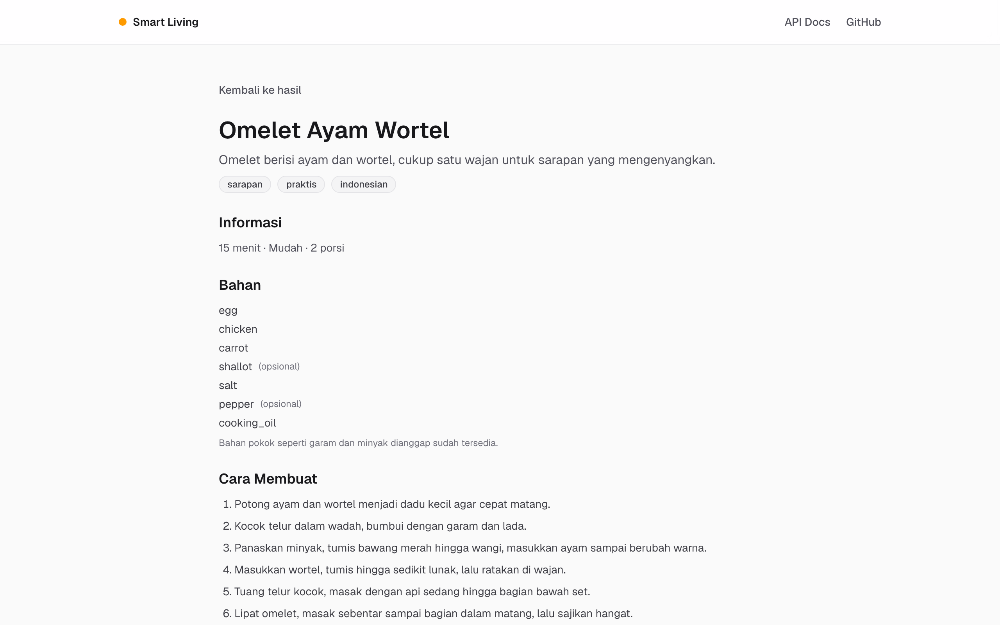
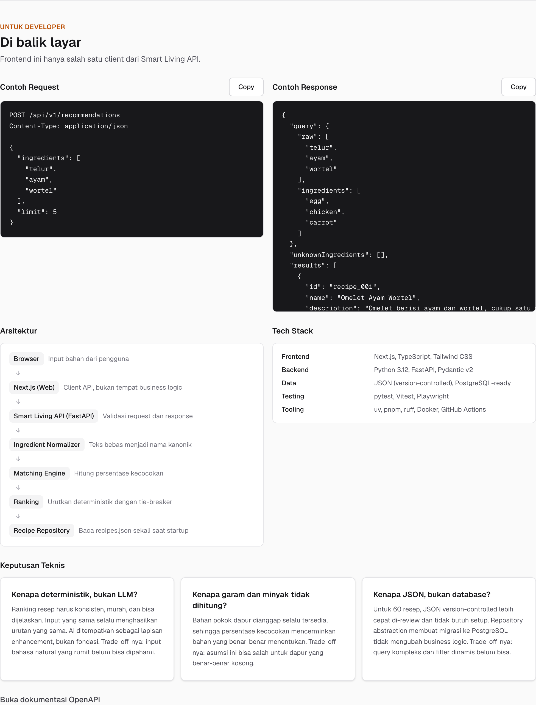

# Smart Living API

**Mengubah bahan makanan sisa menjadi keputusan memasak yang berguna.**

Orang sering punya bahan sisa di kulkas tapi tidak tahu harus memasak apa — bahan
kedaluwarsa, uang habis untuk beli makanan, dan waktu terbuang mencari resep satu per
satu. Smart Living menutup jarak antara *"saya punya bahan ini"* dan *"berikut yang bisa
saya masak"*: masukkan bahan yang ada, dapatkan resep terurut berdasarkan seberapa
lengkap bahannya, lengkap dengan apa yang masih perlu dibeli.

Recommendation engine-nya **deterministik** — input dan dataset yang sama selalu
menghasilkan urutan yang sama. Bisa dijelaskan, murah, dan mudah diuji. AI diposisikan
sebagai lapisan enhancement di masa depan, bukan fondasi.

| | |
|---|---|
| **Demo** | https://smart-living-web-silk.vercel.app |
| **API Docs** | https://smart-living-api-p343.vercel.app/docs |
| **Dataset** | 60 resep, 94 bahan kanonik, masakan Indonesia |
| **Test** | 518 backend, 201 frontend, 10 E2E |
| **Coverage** | 100% pada `app/` (gate CI 90%) |
| **Latency** | p50 1.1 ms, p95 1.4 ms (lokal, 200 request) |



| | |
|---|---|
|  |  |
|  |  |

Chip "tidak dikenali" pada gambar ketiga adalah Contract Delta v1.1: bahan di luar kamus
dilaporkan apa adanya dengan HTTP 200, bukan ditolak sebagai error.

---

## Daftar Isi

1. [Cara kerja recommendation engine](#cara-kerja-recommendation-engine)
2. [Arsitektur](#arsitektur)
3. [Menjalankan secara lokal](#menjalankan-secara-lokal)
4. [Contoh API](#contoh-api)
5. [Testing](#testing)
6. [Keputusan teknis & trade-off](#keputusan-teknis--trade-off)
7. [Deployment](#deployment)
8. [Yang belum dikerjakan](#yang-belum-dikerjakan)
9. [Dokumentasi lengkap](#dokumentasi-lengkap)

---

## Cara kerja recommendation engine

Empat tahap, semuanya deterministik:

```
input bebas          →  normalisasi        →  scoring         →  ranking
"2 butir telur"          egg                  per resep          urutan final
"ayam", "wortel"         chicken, carrot      0–100%             + tie-breaker
```

### 1. Normalisasi

Teks bebas menjadi nama kanonik lewat kamus alias. Tanpa LLM, tanpa fuzzy matching.

| Input | Canonical | Aturan |
|---|---|---|
| `" TELUR "` | `egg` | trim + lowercase + alias Indonesia |
| `telor` | `egg` | alias typo umum |
| `2 butir telur` | `egg` | buang prefix angka + satuan |
| `100 gr ayam` | `chicken` | idem |
| `chicken breast` | `chicken` | alias bentuk spesifik |
| `carrots` | `carrot` | aturan plural |
| `kangkung` | — | di luar kamus → `unknownIngredients` |

Input yang tidak dikenali **tidak ditebak**. Ia dilaporkan apa adanya supaya user tahu.

### 2. Scoring

```
matchPercentage = matched_required_non_staple / total_required_non_staple × 100
```

Contoh: resep butuh `egg, chicken, carrot, onion`, user punya tiga yang pertama →
3/4 = **75%**.

Bahan pokok (garam, minyak, air, lada, gula) **dikecualikan** dari perhitungan. Tanpa
aturan ini, resep yang butuh garam dan minyak akan selalu kehilangan poin meski user
punya semua bahan utama — angkanya jadi menyesatkan.

| | Tanpa staple exclusion | Dengan staple exclusion |
|---|---|---|
| Resep butuh `egg, chicken, salt, oil` | | |
| User punya `egg, chicken` | 2/4 = 50% | 2/2 = **100%** |

Bahan opsional (`required: false`) juga tidak masuk denominator dan tidak muncul di
`missingIngredients` — opsional bukan kekurangan.

### 3. Ranking

Empat tingkat tie-breaker, sehingga urutan selalu sama untuk input yang sama:

```
1. matchPercentage      DESC   paling cocok dulu
2. missingCount         ASC    lebih sedikit yang perlu dibeli
3. cookingTimeMinutes   ASC    lebih cepat dulu
4. recipeId             ASC    tie-breaker terakhir yang pasti
```

Urutan operasi: **score → filter threshold (30%) → sort → limit (5)**. Filter sebelum
limit, supaya slot hasil tidak terpakai oleh resep yang akan dibuang.

### 4. Hasil

```
telur, ayam, wortel  →  100%  Omelet Ayam Wortel        (semua bahan utama ada)
                          50%  Telur Dadar Daun Bawang
                          50%  Sup Ayam Wortel Kentang
                          40%  Tumis Ayam Sayur Kecap
                          33%  Tumis Kembang Kol Telur
```

---

## Arsitektur

API-first: frontend adalah salah satu client, bukan tempat business logic.

```
Browser
   │
   ▼
Next.js (Web)                    client API — tanpa business logic
   │  HTTP / JSON
   ▼
Smart Living API (FastAPI)       validasi request & response
   │
   ├─► Ingredient Normalizer     teks bebas → nama kanonik
   ├─► Matching Engine           hitung persentase kecocokan
   └─► Ranking                   urutkan deterministik
        │
        ▼
   Recipe Repository             abstraksi akses data
        │
        ▼
   recipes.json                  dimuat sekali saat startup
```

### Lapisan backend

| Lapisan | Direktori | Tanggung jawab | Dilarang |
|---|---|---|---|
| HTTP | `app/api/v1/routes/` | Request → validasi → service → response | Menghitung skor, akses data langsung |
| Schema | `app/schemas/` | Kontrak API, serialisasi `camelCase` | Business logic |
| Service | `app/services/` | Orkestrasi use case | Tahu HTTP, baca file |
| Domain | `app/domain/` | Scoring, matching, ranking | Import framework apa pun |
| Repository | `app/repositories/` | Akses data | Menentukan ranking |

Aturan ini **ditegakkan otomatis** oleh test yang mem-parsing AST setiap modul
(`tests/unit/test_architecture_boundary.py`). Import `fastapi` di `app/domain/` akan
membuat CI merah.

Frontend juga menampilkan arsitektur ini kepada pembaca, di section "Di balik layar":



### Struktur repository

```
apps/
├── api/                  FastAPI — Python 3.12
│   ├── app/
│   │   ├── api/v1/       route + dependency wiring
│   │   ├── schemas/      Pydantic v2, camelCase
│   │   ├── services/     normalizer, recommendation service
│   │   ├── domain/       matching engine, scoring, ranking, model
│   │   ├── repositories/ JSON repository + interface
│   │   └── core/         config, logging, errors, composition root
│   ├── scripts/          validator dataset, benchmark
│   └── tests/            unit + integration
│
└── web/                  Next.js 16 — TypeScript
    ├── app/              routing & komposisi halaman
    ├── components/       ingredients, recommendations, recipes, showcase, ui
    ├── lib/api/          satu-satunya jalur HTTP ke API
    ├── lib/constants/    seluruh copy user-facing
    ├── hooks/            state & data fetching
    ├── tests/            unit + component + audit otomatis
    └── e2e/              Playwright

data/recipes/             dataset version-controlled
docker/                   Dockerfile API & web
docs/                     PRD, arsitektur, skema, roadmap, task breakdown
```

---

## Menjalankan secara lokal

### Prasyarat

| Tool | Versi | Untuk apa |
|---|---|---|
| [Python](https://www.python.org/) | 3.12 | Runtime API |
| [uv](https://docs.astral.sh/uv/) | ≥ 0.4 | Package manager Python |
| [Node.js](https://nodejs.org/) | ≥ 22 | Runtime web |
| [pnpm](https://pnpm.io/) | 11.24.0 | Package manager web |

```bash
# macOS
brew install uv node pnpm
```

`uv` akan mengunduh Python 3.12 sendiri bila belum tersedia.

### 1. Clone

```bash
git clone https://github.com/Callmerev95/smart-living-API.git
cd smart-living-API
```

### 2. Jalankan API

```bash
cd apps/api
uv sync
uv run uvicorn app.main:app --reload --port 8000
```

Verifikasi:

```bash
curl http://localhost:8000/api/v1/health
# {"status":"ok","recipeCount":60,"ingredientCount":94}
```

Dokumentasi interaktif: <http://localhost:8000/docs>

### 3. Jalankan web

Di terminal baru:

```bash
cd apps/web
cp .env.example .env.local     # wajib — tanpa ini web tidak tahu alamat API
pnpm install
pnpm dev
```

Buka <http://localhost:3000>, masukkan `telur, ayam, wortel`.

> **Catatan penting soal `NEXT_PUBLIC_API_BASE_URL`**
>
> Variabel ini **dibakar saat build**, bukan dibaca saat runtime. Konsekuensinya:
> mengubah nilainya butuh build ulang, dan satu build tidak bisa dipakai untuk dua
> environment dengan URL API berbeda.

### 4. Alternatif: Docker

```bash
docker compose up --build
# buka http://localhost:3000
```

Compose menjalankan API (`:8000`) dan web (`:3000`), dengan healthcheck pada API
sehingga web baru start setelah API siap.

<details>
<summary>Docker di macOS tanpa Docker Desktop</summary>

Docker Desktop cukup berat di mesin dengan RAM terbatas. Alternatifnya
[Colima](https://colima.run):

```bash
brew install colima docker docker-compose
colima start --cpu 2 --memory 2 --disk 20
docker compose up --build
```

`colima stop` untuk membebaskan resource saat tidak dipakai.

</details>

### Variabel environment

| Variabel | Default | Keterangan |
|---|---|---|
| `CORS_ORIGINS` | `http://localhost:3000` | Origin yang diizinkan. Jangan pakai `*`. |
| `LOG_LEVEL` | `INFO` | Level logging |
| `DEFAULT_LIMIT` | `5` | Jumlah hasil default |
| `MAX_LIMIT` | `10` | Batas atas `limit` |
| `MIN_MATCH_THRESHOLD` | `30` | Ambang relevansi (%) |
| `MAX_INGREDIENTS_PER_REQUEST` | `30` | Guard ukuran payload |
| `MAX_INGREDIENT_NAME_LENGTH` | `60` | Guard panjang nama bahan |
| `RECIPES_PATH` | `data/recipes/recipes.json` | Lokasi dataset resep |
| `INGREDIENTS_PATH` | `data/recipes/ingredients.json` | Lokasi kamus bahan |
| `NEXT_PUBLIC_API_BASE_URL` | `http://localhost:8000` | Base URL API (build-time) |

Contoh lengkap ada di `.env.example` (root) dan `apps/web/.env.example`.

---

## Contoh API

### `POST /api/v1/recommendations`

```bash
curl -X POST http://localhost:8000/api/v1/recommendations \
  -H "Content-Type: application/json" \
  -d '{"ingredients": ["telur", "ayam", "wortel"], "limit": 3}'
```

Response (dipangkas ke satu hasil, langkah dipotong):

```json
{
  "query": {
    "raw": ["telur", "ayam", "wortel"],
    "ingredients": ["egg", "chicken", "carrot"]
  },
  "unknownIngredients": [],
  "results": [
    {
      "id": "recipe_001",
      "name": "Omelet Ayam Wortel",
      "description": "Omelet berisi ayam dan wortel, cukup satu wajan untuk sarapan yang mengenyangkan.",
      "matchPercentage": 100,
      "availableIngredients": ["egg", "chicken", "carrot"],
      "missingIngredients": [],
      "cookingTimeMinutes": 15,
      "difficulty": "easy",
      "servings": 2,
      "ingredients": ["egg", "chicken", "carrot", "shallot", "salt", "pepper", "cooking_oil"],
      "steps": [
        "Potong ayam dan wortel menjadi dadu kecil agar cepat matang.",
        "Kocok telur dalam wadah, bumbui dengan garam dan lada."
      ],
      "tags": ["sarapan", "praktis", "indonesian"]
    }
  ],
  "meta": { "count": 3, "limit": 3, "threshold": 30 }
}
```

Tiga hal yang membedakan response ini dari desain awal:

- **`matchPercentage: 100`** meski resep butuh `salt`, `pepper`, dan `cooking_oil` —
  bahan pokok dikecualikan dari perhitungan.
- **`query.raw` dan `query.ingredients`** keduanya dikirim, supaya frontend bisa
  menampilkan pemetaan `telur → Telur` dan user paham bahan apa yang dipakai sistem.
- **`unknownIngredients`** memuat bahan di luar kamus, dengan HTTP 200 — satu bahan tak
  dikenal tidak menggagalkan seluruh pencarian.

### Bahan tak dikenal

```bash
curl -X POST http://localhost:8000/api/v1/recommendations \
  -H "Content-Type: application/json" \
  -d '{"ingredients": ["telur", "kangkung"]}'
```

```json
{
  "query": { "raw": ["telur", "kangkung"], "ingredients": ["egg"] },
  "unknownIngredients": ["kangkung"],
  "results": [ /* resep berbahan telur tetap dikembalikan */ ],
  "meta": { "count": 3, "limit": 5, "threshold": 30 }
}
```

### Endpoint lain

| Endpoint | Keterangan |
|---|---|
| `GET /api/v1/recipes/{id}` | Detail resep. `404 RECIPE_NOT_FOUND` bila tidak ada. |
| `GET /api/v1/ingredients` | Kamus 94 bahan + alias, untuk autocomplete |
| `GET /api/v1/health` | Status + jumlah resep & bahan yang ter-load |

### Format error

Konsisten untuk semua endpoint:

```json
{
  "error": {
    "code": "INVALID_INGREDIENTS",
    "message": "Bahan harus berisi setidaknya satu item.",
    "details": null
  }
}
```

`code` adalah kontrak yang stabil — frontend memetakan `code`, bukan `message`.
Stack trace tidak pernah dikirim ke client.

| Code | HTTP | Kapan |
|---|---|---|
| `INVALID_INGREDIENTS` | 400 | Bahan kosong atau melewati batas |
| `VALIDATION_ERROR` | 422 | Struktur request salah |
| `RECIPE_NOT_FOUND` | 404 | Id resep tidak ada |
| `INTERNAL_ERROR` | 500 | Kesalahan tak terduga |

---

## Testing

```bash
# Backend — 518 test, coverage gate 90%
cd apps/api
uv run pytest
uv run ruff check .
uv run python scripts/validate_dataset.py     # integritas dataset

# Frontend — 201 test
cd apps/web
pnpm test
pnpm typecheck
pnpm lint

# E2E — 10 skenario, menyalakan API + web sendiri
pnpm e2e
```

### Cakupan

| Lapisan | Jumlah | Fokus |
|---|---|---|
| Domain (unit) | 195 | Normalisasi, scoring, ranking, determinisme, model |
| Service | 24 | Orkestrasi dengan fake repository |
| API (integration) | 87 | Kontrak, validasi, error, logging, OpenAPI |
| Dataset | 41 | 16 aturan validasi, referential integrity |
| Boundary | 15 | Aturan dependency, via parsing AST |
| Deployment | 14 | Entrypoint Vercel, dependency pinning, dataset ikut ter-deploy |
| Component (web) | 201 | Render, interaksi, state, a11y, audit copy & metadata |
| E2E | 10 | Alur nyata di browser |

Beberapa test yang menjaga hal yang mudah rusak diam-diam:

- **Determinisme** — input dan urutan repository diacak, hasil harus identik.
- **Boundary arsitektur** — mem-parsing AST untuk memastikan `app/domain/` tidak
  mengimpor framework, dan route tidak mengakses data langsung.
- **Audit copy** — memastikan tidak ada string user-facing yang hardcode di JSX, dan
  hanya `lib/api/` yang memanggil `fetch`.
- **Contract Delta** — 18 test khusus yang menjaga tiga keputusan produk (staple
  exclusion, `unknownIngredients`, normalisasi transparan) tidak hilang saat refactor.

### CI

Lima job berjalan pada setiap push dan pull request:

| Job | Isi |
|---|---|
| `dataset` | Validator dataset — dataset rusak = CI merah |
| `api` | ruff lint + format + pytest + coverage gate |
| `web` | eslint + typecheck + vitest + build |
| `docker` | Build kedua image, jalankan, smoke test |
| `e2e` | Playwright terhadap API + web nyata |

---

## Keputusan teknis & trade-off

### Deterministik, bukan LLM

Ranking resep harus konsisten, murah, dan bisa dijelaskan. Input yang sama selalu
menghasilkan urutan yang sama — tidak ada variasi antar request, tidak ada biaya per
panggilan, dan mudah diuji.

**Trade-off:** input bahasa natural yang rumit ("saya punya dua telur dan sisa ayam
panggang") belum bisa dipahami. Ini disengaja: AI ditempatkan sebagai lapisan parsing di
masa depan, di belakang service boundary, tanpa mengubah engine.

### Bahan pokok dikecualikan dari scoring

Garam, minyak, air, lada, dan gula dianggap selalu tersedia. Persentase kecocokan jadi
mencerminkan bahan yang benar-benar menentukan.

**Trade-off:** asumsi ini salah untuk dapur yang benar-benar kosong. Untuk audiens
produk ini — orang yang punya bahan sisa dan ingin memasak hari ini — asumsinya jauh
lebih sering benar daripada salah.

### JSON, bukan database

Untuk 60 resep, JSON version-controlled lebih cepat di-review lewat pull request dan
tidak butuh setup apa pun. Perubahan dataset terlihat sebagai diff.

**Trade-off:** query kompleks dan filter dinamis belum mungkin. Repository abstraction
membuat migrasi ke PostgreSQL tidak menyentuh business logic — hanya menambah satu
implementasi interface.

### Domain layer bebas framework

`app/domain/` hanya mengimpor standard library. Matching engine bisa diuji tanpa
menyalakan server, dan formula scoring tidak terikat pada FastAPI maupun Pydantic.

**Trade-off:** butuh lapisan mapper eksplisit antara domain dan schema API. Biaya ini
dibayar sekali; imbalannya test domain yang cepat dan bisa dipahami tanpa konteks HTTP.

### Pembulatan half-up ditulis manual

`round()` bawaan Python memakai banker's rounding: `round(12.5)` menghasilkan 12, bukan
13. Untuk persentase yang dilihat user, itu mengejutkan. Scoring memakai `divmod`
integer agar pembulatan selalu half-up.

**Trade-off:** empat baris lebih panjang daripada memanggil `round()`. Ada delapan test
kasus pembulatan yang menjaganya.

---

## Deployment

Web **dan** API di **Vercel** — dua project dari repository yang sama, dibedakan oleh Root
Directory. Panduan lengkap beserta perbandingan platform, urutan langkah, dan checklist
keamanan: **[`docs/deployment.md`](docs/deployment.md)**.

Ringkasnya:

1. Deploy API: Root Directory `/`, framework "Other". Vercel memuat
   [`index.py`](index.py) sebagai Python Function.
2. Deploy web: Root Directory `apps/web`, dengan `NEXT_PUBLIC_API_BASE_URL` = URL API.
3. Set `CORS_ORIGINS` di project API ke domain web — **bukan** `*` — lalu redeploy.
4. Uji alur end-to-end di production.

Urutannya penting: `NEXT_PUBLIC_API_BASE_URL` dibakar saat build, jadi URL API harus
sudah diketahui sebelum web di-build.

### Soal Docker

Docker tidak dipakai di jalur production. Setelah membandingkan platform, tidak ada yang
menyediakan Docker gratis permanen tanpa kartu kredit — Hugging Face memindahkan Docker
Spaces ke plan berbayar, Railway hanya memberi trial 30 hari, dan Render punya cold start
50 detik. Vercel dipilih karena mengorbankan hal yang paling sedikit merugikan.

Container tetap dipelihara dan **diverifikasi otomatis di CI**: job `docker` membangun
kedua image, menjalankannya, lalu melakukan smoke test pada health endpoint, halaman web,
dan alur rekomendasi pada setiap push. `docker compose up` juga tetap berfungsi untuk
pengembangan lokal. Jadi kemampuan containerization terbukti oleh pipeline, bukan sekadar
diklaim.

---

## Yang belum dikerjakan

Daftar ini sengaja jujur — batas cakupan adalah bagian dari keputusan produk.

| Item | Alasan ditunda |
|---|---|
| **Parsing bahasa natural dengan AI** | Core deterministik harus stabil dulu. Boundary-nya sudah disiapkan (`services/ai/`), tapi belum ada implementasi. |
| **Kuantitas bahan** | Menambah dimensi pada scoring. Perlu data kuantitas di seluruh dataset dan aturan konversi satuan yang belum sepadan nilainya untuk MVP. |
| **Input dari foto** | Butuh vision model plus alur konfirmasi user. Enhancement, bukan fondasi. |
| **Personalisasi** | Preferensi diet, alergen, dan riwayat butuh akun user — dan akun user butuh database. |
| **Autocomplete bahan** | Endpoint `GET /api/v1/ingredients` sudah menyediakan datanya; UI-nya belum dibuat. |
| **Rate limiting** | Belum dibutuhkan selama API melayani demo portfolio. |
| **PostgreSQL** | Repository abstraction sudah siap. Migrasi dilakukan ketika jumlah resep atau kebutuhan filter benar-benar menuntutnya. |
| **Screenshot & GIF demo** | Menunggu deployment agar aset yang diambil mencerminkan versi live. |

---

## Dokumentasi lengkap

| Dokumen | Menjawab |
|---|---|
| [`docs/prd.md`](docs/prd.md) | Apa yang dibangun dan mengapa |
| [`docs/technical-architecture.md`](docs/technical-architecture.md) | Bagaimana sistem dibangun |
| [`docs/component-architecture.md`](docs/component-architecture.md) | Komponen apa saja dan tanggung jawabnya |
| [`docs/content-schema.md`](docs/content-schema.md) | Kontrak data, aturan scoring, seluruh copy UI |
| [`docs/development-roadmap.md`](docs/development-roadmap.md) | Urutan fase dan exit criteria |
| [`docs/implementation-task-breakdown.md`](docs/implementation-task-breakdown.md) | 84 task dengan acceptance criteria |
| [`docs/case-study.md`](docs/case-study.md) | Narasi produk: masalah, insight, trade-off |
| [`docs/deployment.md`](docs/deployment.md) | Panduan deploy Vercel (web & API) |
| [`AGENTS.md`](AGENTS.md) | Operating manual untuk kontributor & AI agent |

---

## Tech stack

| Layer | Teknologi |
|---|---|
| Frontend | Next.js 16, TypeScript, Tailwind CSS 4 |
| Backend | Python 3.12, FastAPI, Pydantic v2 |
| Data | JSON version-controlled, PostgreSQL-ready |
| Testing | pytest, Vitest, React Testing Library, Playwright |
| Tooling | uv, pnpm, ruff, ESLint, Docker, GitHub Actions |

## Lisensi

Seluruh resep dalam dataset ditulis original (`source: "original"`) untuk menghindari
persoalan lisensi.
